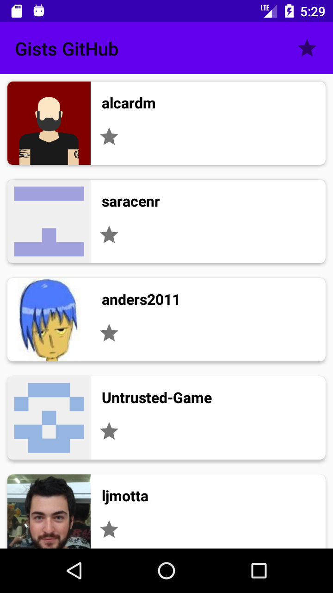
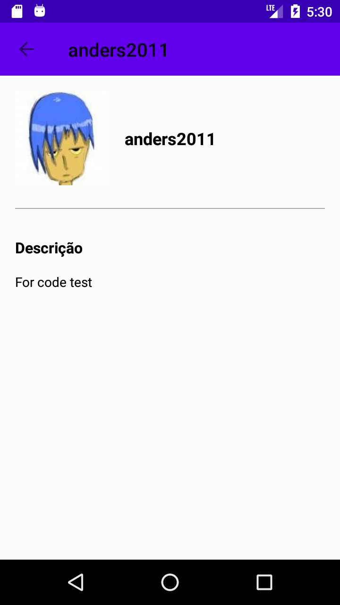
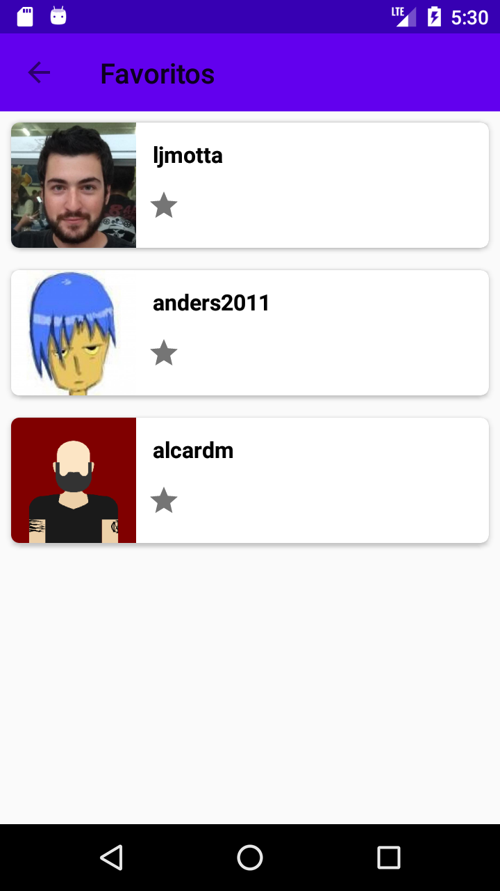
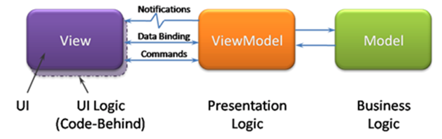

# Desafio Android:

<p align="center">
  
  
  
</p>
<a name="flow" />

1. [Introdução](#introduction)
2. [Requisitos](#requirements)
3. [Arquitetura](#architecture)
4. [Recursos](#resources)
5. [Considerações](#considerations)
5. [Instalação](#setup)
6. [Licença](#license)
<a name="introduction" />

## Introdução

Desafio proposto para a vaga de desenvolvedor Android. De acordo com o teste, você deve fazer um aplicativo que liste os Gists públicos.
<a name="requirements" />

## Requisitos:

Obrigatórios:

A tela de lista deve conter:
- Nome do dono do Gist
- Foto do dono do Gist
- Capacidade de favoritar
- Typos de Gist (application/xml, text/plain, etc)
- Infinite Scrolling

A tela de detalhe deve conter:
- Tela de detalhe acessada via click do item na lista de Gists
- Nome do dono do Gist
- Foto do dono do Gist
- Demais informações caso desejar

A tela de lista de Favoritos deve conter:
- Adição/remoção de usuários localmente
- A lista de favoritos deve ser offline
- Nome do dono do Gist
- Foto do dono do Gist

Mais Pontos:
- Pesquisa do dono do Gist
- Mais de um flavor com diferentes cores, principal, ícones, etc.
- Testes
- Tratamento de erros (Network, etc)
- Fazer um design bonito para o app.
<a name="architecture" />

## Arquitetura

A arquitetura utilizada foi a MVVM (Model View ViewModel), separados por features com 3 camadas: repository, viewmodel e ui.

<p align="center">
  
</p>

<a name="resources" />

## Recursos

 - Kotlin
 - Androidx
 - MVVM e LiveData
 - Architecture Components
 - Retrofit
 - Moshi
 - Serializable
 - Glide
 - DataBinding e ViewBinding
 - Coroutines
 - Koin
 - Room
 - Junit e Mockito
 - Expresso
<a name="considerations" />

## Considerações

- Não consegui pegar o gists type porque eram dinâmicos. Até pesquisei sobre como pegar, mas ia me tomar muito tempo
- Comecei a fazer infinite scroll, mas acabei me enrolando e não consegui fazer
- No testes, acabou não dando tempo de fazer teste pra camada de repository
<a name="setup" />

## Instalação

Para rodar esse projeto, faça um clone do repositório na sua máquina.
Faça o build da aplicação utilizando Android Studio ou via terminal com ```./gradlew assembleDebug```
<a name="license" />

## Licença
<aside class="notice">

Copyright 2020 Ricardo Sousa

Licensed under the Apache License, Version 2.0 (the "License");
you may not use this file except in compliance with the License.
You may obtain a copy of the License at

    http://www.apache.org/licenses/LICENSE-2.0

Unless required by applicable law or agreed to in writing, software
distributed under the License is distributed on an "AS IS" BASIS,
WITHOUT WARRANTIES OR CONDITIONS OF ANY KIND, either express or implied.
See the License for the specific language governing permissions and
limitations under the License.

</aside>
